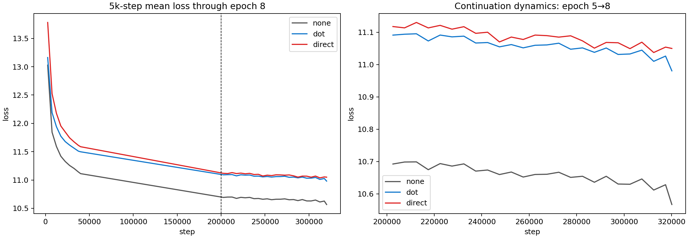

# Epoch-8 training dynamics

The epoch-5 checkpoints were continued to 320,250 optimizer steps. Values below
are means of the trainer's logged 50-step averages over 40k-step windows.

| Arm | 200k–240k slope | 240k–280k slope | 280k–320k slope | 200k–320k mean |
|---|---:|---:|---:|---:|
| none | −4.60e−7 | −3.37e−7 | −8.13e−7 | −6.45e−7 |
| dot | −4.90e−7 | −2.06e−7 | −8.01e−7 | −6.15e−7 |
| direct | −4.13e−7 | +0.02e−7 | −5.36e−7 | −6.60e−7 |

The 5k-step block means show:

- "direct minus dot" stays around 0.02–0.03 loss units from 220k–300k steps. Direct has effectively reached dot's training-loss level; the epoch-8 endpoint noise should not be interpreted as a new gap.
- "dot minus none" remains approximately 0.40 loss units. None continues toward a lower loss floor rather than catching dot.
- All three arms are still decreasing, but the slopes are now small and noisy. Direct has a short near-flat window around 240k–280k, followed by renewed descent; this is not evidence of divergence or collapse.
- Throughput remains stable: none ~8.8 steps/sec, dot ~4.77, direct ~4.75. The direct overhead is stable rather than worsening with training.

This strengthens the earlier interpretation: direct is not failing to optimize its
scalar objective. It converges to approximately the dot loss level, while none
occupies a different lower-loss parameterization. The decisive comparison remains
epoch-8 FID and sampling behavior, not absolute regression loss.
